# 전체 아키텍처


---
# Spring Boot
- Spring Boot는 Java 기반의 웹 애플리케이션을 빠르고 쉽게 개발할 수 있도록 도와주는 프레임워크입니다. 


---
### 단계1: 프로젝트 실행 
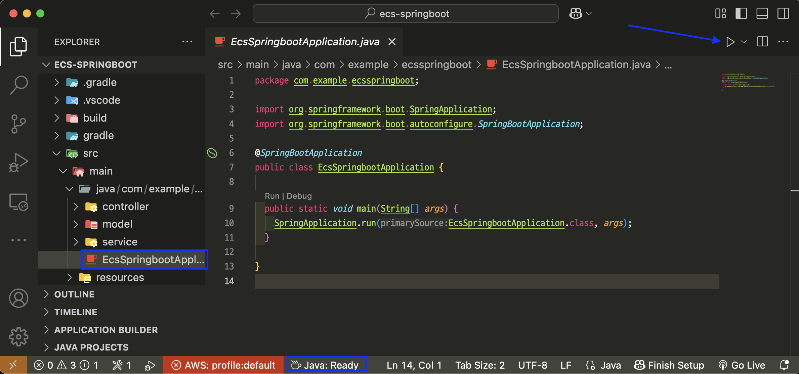

---
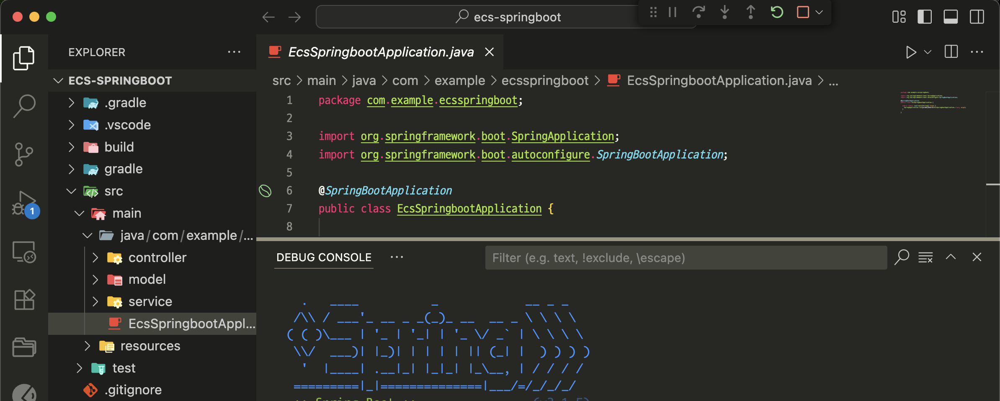

---
### 단계2: 프로젝트 테스트
```shell
http://localhost:8080/hello
```
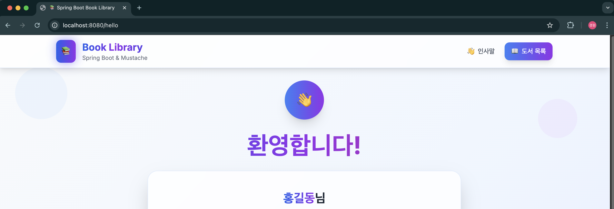

---
# Docker
- Docker는 애플리케이션을 컨테이너(container)라는 가상화된 환경에서 실행할 수 있도록 해주는 오픈소스 플랫폼입니다.

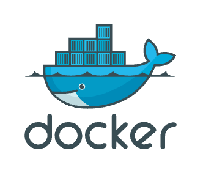

---
### 단계1: Docker 실행 
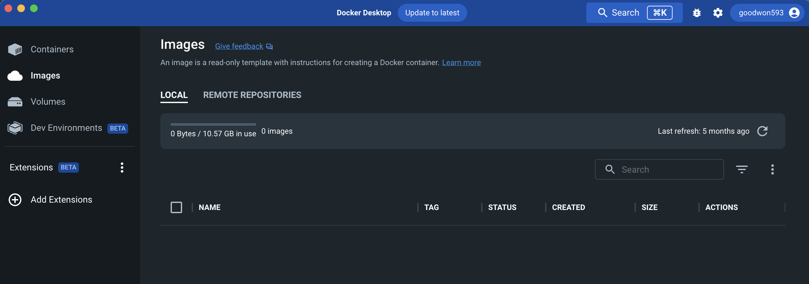

---
### 단계2: Dockerfile 확인
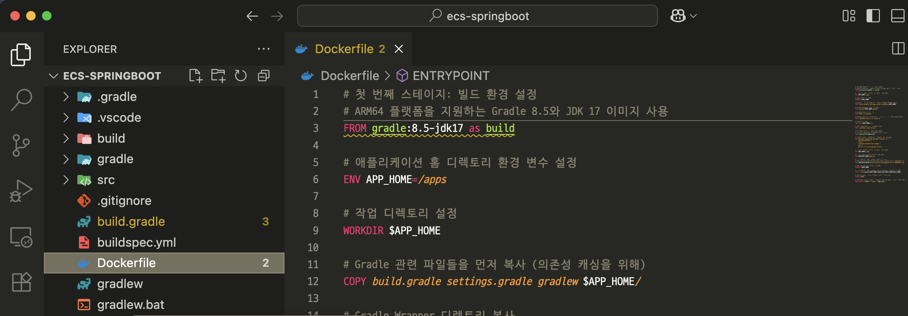

---
### 단계3: Docker Iamge 생성
```shell
# docker image 생성
docker build -f ./Dockerfile -t ecs-springboot:latest .

# ARM 기반 CPU인 경우
docker build --platform linux/arm64 -f ./Dockerfile -t ecs-springboot:latest .
```
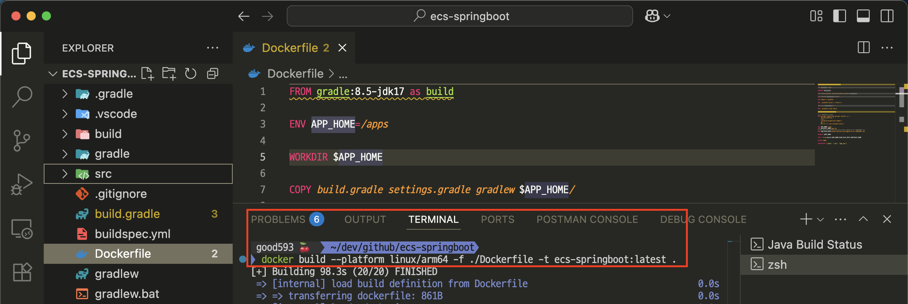

---
### 단계4: Docker Iamge 생성 확인
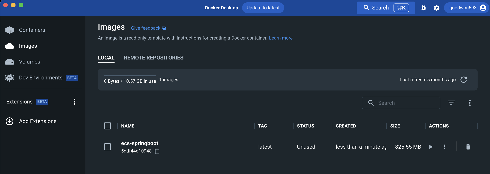

---
### 단계5: Docker Container 생성 및 실행 
```shell
# Container 생성 및 실행 
docker run -d -p 8080:8080 --name ecs-springboot-container ecs-springboot:latest

# 확인 
docker ps
```
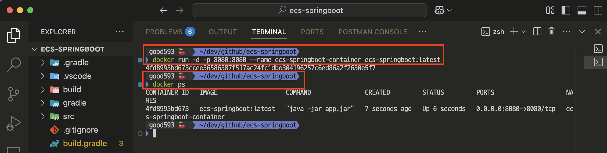

---
### 단계6: 테스트 
```shell
http://localhost:8080/hello
```


---
### 단계5: Docker Container 삭제
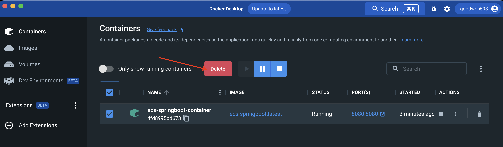

---
# Github 
- GitHub는 개발자들이 코드를 저장하고, 협업하며, 버전 관리를 할 수 있는 웹 기반 플랫폼입니다.


---
### 단계1: Initialize Repository
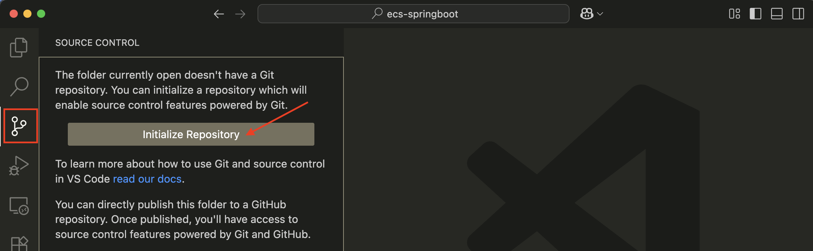

---
### 단계2: Commit
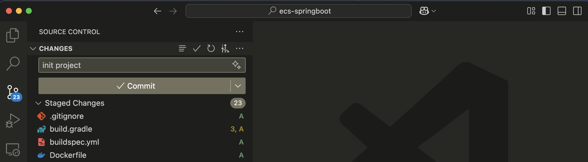

---
### 단계3: Publish Branch
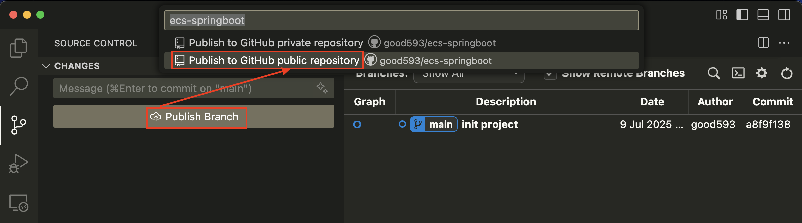

---
### 단계4: Github에서 확인 
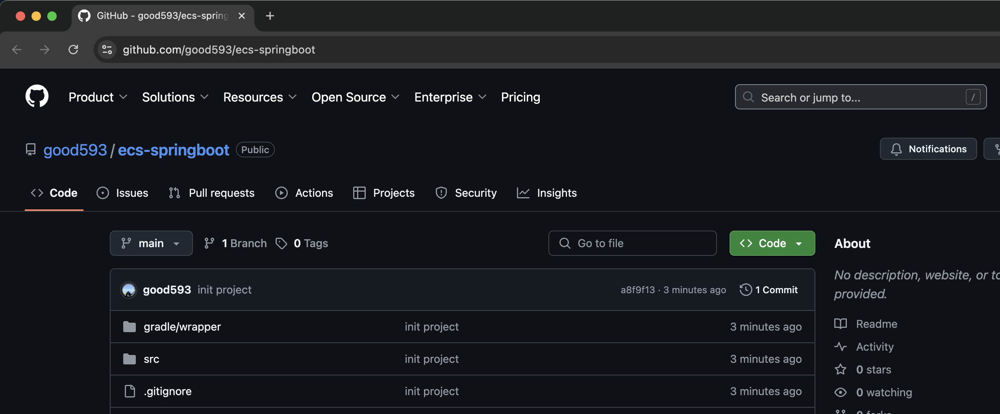
