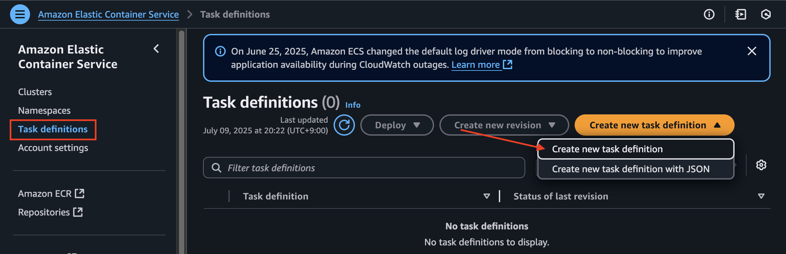
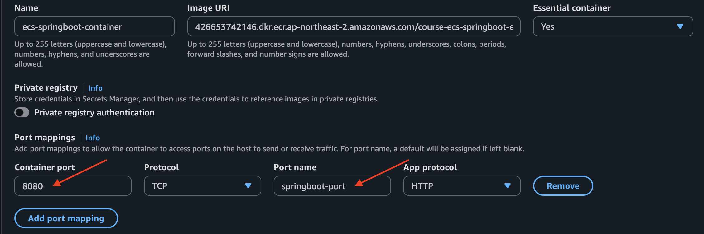
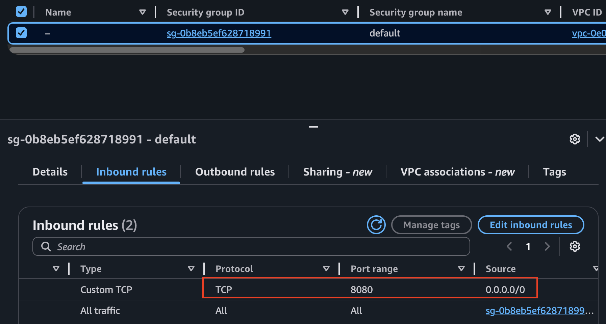

# 전체 아키텍처


---
# Amazon ECS
- AWS ECS (Elastic Container Service)는 Docker 컨테이너를 손쉽게 배포, 관리, 확장할 수 있도록 도와주는 완전관리형 컨테이너 오케스트레이션 서비스입니다.


---
## 1. ecsTaskServiceRole 생성

---
### 단계1: IAM 접속 


---
### 단계2: Create Role


---


---


---
> Add AmazonSSMReadOnlyAccess


---
> ecsTaskServiceRole


---


---


---


---
### 단계3: 확인


---
## 3. ECS Task 생성 

---
### 단계1: ECS 접속 


---
### 단계2: Create new task definition


---
> ecs-springboot-task


---


---


---
> ecs-springboot-container


---


---


---


---
> CMD-SHELL,curl -f http://localhost:8080/health || exit 1


---


---


---
### 단계3: 확인 


---
## 4. ECS Cluster 생성 

---
### 단계1: Create cluster


---


---


---
### 단계2: 확인 
> 처음 한 번은 오류가 발생할 수 있지만, 다음 시도에서 AWS가 자동으로 역할을 생성할 수 있음.


---
## 5. ECS Service 생성 

---
### 단계1: ECS Cluster 선택 


---
### 단계2: ECS Service > Create


---


---


---


---


---


---
### 단계3: ECS Service 선택


---
### 단계4: ECS Service > task 선택


---
### 단계5: Public IP 복사 


---
## 6. ECS 접속 테스트 

---
### 단계1: EC2 접속 


---
### 단계2: Security Groups 


---
### 단계3: Edit inbound rules


---
> 8080 port


---


---
### 단계4: 접속 테스트
```shell
http://[Public IP]:8080/hello
```


