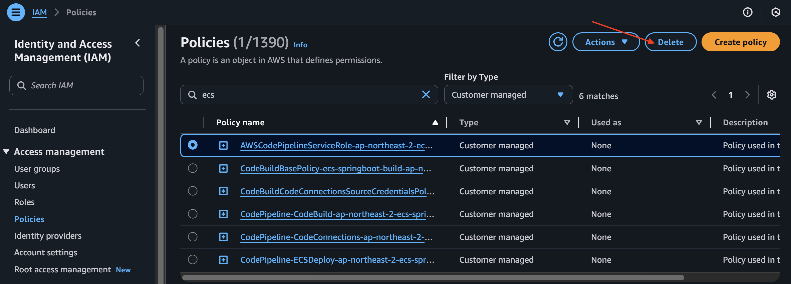

# 전체 아키텍처

---
# CodePipeline 삭제 

---
# CodeBuild 삭제 

---

---
# Connections 삭제 

---
# Security Groups 삭제 

---

---
# Amazon ECS 삭제

---
### 단계1: ECS Service 삭제 

---

---
### 단계2: ECS Cluster 삭제 

---
### 단계3: ECS Task 삭제

---

---

---
# IAM 삭제

---
### 단계1: Roles 삭제 

---
### 단계2: Policies 삭제 

